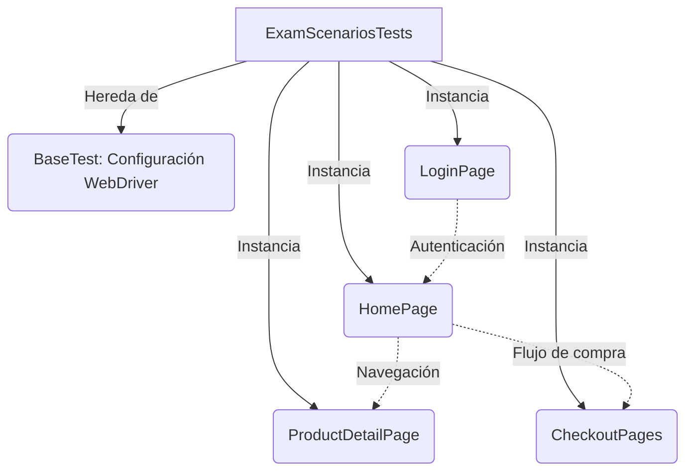

# CERTIFICACION 2 - SauceDemo UI

Proyecto de automatización de pruebas para la plataforma de e-commerce SauceDemo. El objetivo principal es evaluar flujos críticos de negocio mediante pruebas E2E (End-to-End), aplicando estándares de la industria sobre selectores robustos, aserciones precisas y estructuración modular de código.

## Arquitectura del Proyecto (Page Object Model)

El proyecto está diseñado bajo el patrón Page Object Model (POM) apoyado por PageFactory. Esta arquitectura garantiza la separación de responsabilidades: las clases de página manejan los localizadores de la interfaz y las interacciones del usuario, mientras que la clase de pruebas se enfoca exclusivamente en la orquestación del flujo y la validación final.

## Stack Tecnológico

| **Herramienta** | **Versión** | **Uso en el Proyecto** |
|---|---|---|
| Java | 26 | Lenguaje de programación base. |
| Selenium WebDriver | 4.47.0 | Interacción y manipulación del DOM en el navegador. |
| JUnit (Jupiter API) | 6.1.3 | Framework para la estructuración y ejecución de los casos de prueba. |
| WebDriverManager | 6.3.4 | Gestión automática de los binarios del ChromeDriver. |
| Guava | 33.6.0 | Validación algorítmica de ordenamiento en colecciones de datos. |
| IntelliJ IDEA | CE 2026.1.5 | Entorno de desarrollo integrado (IDE) principal del proyecto. |

## Escenarios Automatizados

Se desarrollaron 5 escenarios enfocados en la lógica de negocio y cálculo, excluyendo flujos triviales de navegación:

| **#** | **Escenario** | **Descripción de la Validación** |
|---|---|---|
| 1 | `verifyPostalCodeError` | Verifica el control de errores en el formulario de Checkout. Valida tanto el mensaje de texto esperado como la inserción de clases CSS dinámicas (resaltado en rojo) en los campos requeridos. |
| 2 | `verifyResetAppState` | Comprueba la funcionalidad de limpieza del carrito. Implementa esperas explícitas (`WebDriverWait`) para sincronizar la automatización con las animaciones de despliegue del menú lateral. |
| 3 | `verifyItemRemainsInCart` | Verifica la persistencia del estado (State Management). Asegura que el carrito mantenga los productos seleccionados al navegar entre el catálogo general y el detalle individual de un producto. |
| 4 | `verifyProductsCanBeSorted` | Valida el filtro "Price (high to low)". Extrae los precios del catálogo, los convierte a valores numéricos y utiliza algoritmos de colecciones para confirmar matemáticamente la clasificación descendente. |
| 5 | `verifyTotalCalculatedPrice` | Verifica la precisión de la pasarela de pago. Extrae el subtotal y los impuestos, sumándolos mediante cálculos de alta precisión (`BigDecimal`) con redondeo estándar para compararlos con el total final renderizado en pantalla. |

## Resultados de las Pruebas

Se ejecutó la clase `ExamScenariosTests` mediante JUnit desde IntelliJ IDEA.

**Resultado de la ejecución:**

| **Indicador** | **Resultado** |
|---|---|
| Casos de prueba ejecutados | 5 |
| Casos de prueba fallidos | 0 |
| Ejecución | Exitosa |
| Exit code | `0` |

Los cinco escenarios automatizados finalizaron correctamente, sin errores de ejecución.

Durante la ejecución se presentaron algunos mensajes de advertencia relacionados con SLF4J y con la versión de Chrome DevTools Protocol (CDP). Estos mensajes no impidieron la ejecución de las pruebas ni provocaron fallos en los casos automatizados.

> **Nota:** Selenium indicó que el navegador utiliza CDP versión 152 mientras que Selenium 4.47.0 encontró soporte más cercano para la versión 151. Se recomienda actualizar Selenium a una versión compatible con CDP 152 para eliminar esta advertencia.

## Ejecución Local

1. Clonar el repositorio en el equipo local.
2. Abrir el directorio del proyecto utilizando IntelliJ IDEA Community Edition (2026.1.5 o superior).
3. Sincronizar el archivo `pom.xml` para que Maven descargue las dependencias necesarias.
4. Navegar a la ruta `src/test/java/tests/` y ejecutar la clase `ExamScenariosTests` directamente desde el entorno de desarrollo.